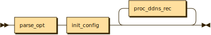
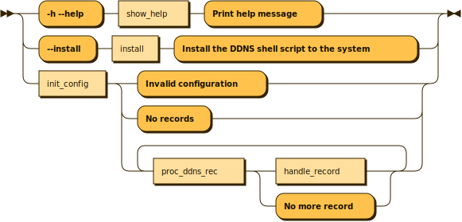
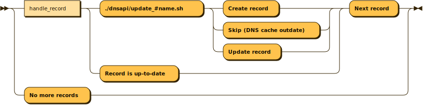

<p align="left">
  English | <a href="README_CN.md">中文</a>
</p>

<div align="center">
  <h1>A DDNS Shell script: ddnss.sh</h1>
</div>

<p align="center">
  <a href="https://github.com/qingzi-zhang/ddnss.sh/blob/main/LICENSE">
    
  </a>
</p>

- A dynamic DNS client, written purely in Unix shell language.
- Bourne Again Shell, Dropbear SSH, Bourne Shell (POSIX compatible).
- Extendable via DNS API and easy to maintain.
- Simple and very easy to use.

## Supported DDNS Services

|Status |API Version|DDNS Services
|:-----:|:---------:|----------------
|✅     |V3         |Tencent DNSPod

# Installation
## Required to install cURL and OpenSSL
- ***Debian***
```
sudo apt update
sudo apt install curl openssl
```
- ***OpenWrt***
```
opkg update
opkg install curl openssl-util
```

## Install from git
```
git clone https://github.com/qingzi-zhang/ddnss.sh.git
cd ./ddnss.sh
sudo sh ddnss.sh --install
```

# Configuration
Edit the DDNS configuration in the file: **`$HOME/.ddnss.sh/ddnss.conf`**
> [!NOTE]
> Optional
>- DNS_Server: The DNS server to use for lookup a DDNS record
>- Log_Path: The log path should be located in the /var/log/ directory and have write permissions

```
DNS_Server=8.8.8.8
Log_Path=/var/log/ddnss
```

> [!TIP]
> - Format of DDNS record: DDNS=domain_fullname,ip_version,interface,update_script_name,API_SecretID,API_SecretKey,eui64_suffix(only for IPv6)
>
```
DDNS=ddns.shell-script.net,IPv6,br-lan,update_dnspod_v3.sh,***Replace_API_SecretID_pair***,***Replace_API_SecretKey_pair***,07e2:00cb:0012:aaaa
```

# Usage
```
Usage:
  ddnss.sh [options]

Options:
  -h, --help           Print this help message
  --config=<file>      Read config from a specific file
  --force-update       Proceed with the update regardless of IP status
  --install            Install the DDNS shell script to the system
  --log-level=<0|1>    Set the log level to 0 or 1 (0: Error, 1: Verbose)
```

# A DDNS Shell script
## Mini flowchart

## Main flowchart

## Process records flowchart
